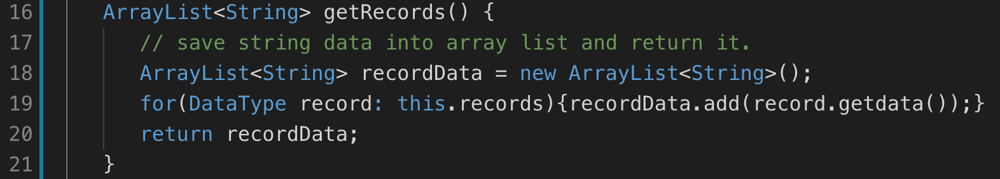

### Basic: 
There have 5 classes to implement the basic Database usage

- Record: With a String type array list
   1. **Record(String... data)**: new an array of String list to records 
   2. **getRecords()**: To return record String Array
Record_size(): get how many columns 

- Table: with a Field array and Attrs array with Record type
   1. **Table(String name, Record field)**: new a table name and field to the table 

   2. **getFields()**: To get the field's array and only can have one record
   3. **getAttrs(int num)**: to get the key of Attrs
   4. **getAttrsSize(String... values)**: return the number of Attrs
   5. **addRecord**: add new attr and if the size of record in attr is not equal the field and throw error
   6. **removeRecord(int num)**: set the Record to null. 
   7. **updateRecord( int num, String... values )**: update the existed record
   8. **printTable()**
   9. **Keys** is going to make sure the data is unique.  
- ImportData
   1. **ImportData(String name)**: open the file and add to record array. The format is 
` id, name, student ` which is used comma to split each cell and new line to change new row 
getData():return arraylist of record

- WriteData
 
   1. **write(String str, String filename)**: Test to write str into file
   2. **writeTable**:  write field and attrs into field and followed the same format of the importData's format. 

- Database
   1. **Database(String name)**: Create a database folder if database is not existed
   2. **CreateTable(String name, Record field)**: Create a table folder if it's not existed.

### Extension 

- Type: the constant of different data type 
- DataType
the method to store data and define the data type
- Record 
   1. Change the String Arraylist to DataType Arraylist
   2. add  **getRecordsType()** method
   3. add **getIndexofRecord()** and **getIndexofRecordType** method
- Table 
   1. addRecord method's name change to **insertRecord**
   2. add check data type method, such as **isInt()** nd **isFloat()**, to make sure data is correct type. 
### Refactoring

- String ArrayList change to DataType ArrayList
   - 
- Before inserting data, it will be checked type is correct
   - 
- A format to make load data into table and write data into file 
   - 
   - 

### Testing  Method
Manually add testing data 

- Record Testing 

- Table Testing

   1. Insert Testing
   
   

   2. Remove Testing
   
   

   3. Update Testing
   
   

### Future Improvement
- Separate to Field and Attributes Class
- Probably create generic class 
- Extend Key usage by using Map class 