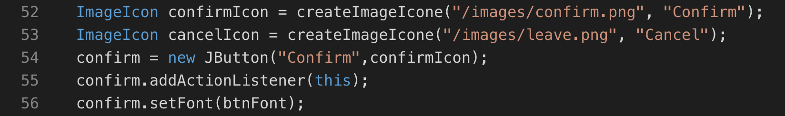

# Java Graphic Assessment - Quiz Creator

## Usage
1. Make sure the folder structure is like 
```
- folder
   - Images
      - background.jpg
      - confirm.png
      - createQ.png
      - leave.png
      - next.png
      - reset.png
      - start.png
      - submit.png
   - Answer.java
   - GameStarts.java
   - Integrate.java
   - Question.java
   - QuestionCreate.java
   - QuestionList.java
   - SelectMenu.java
   - TopMenu.java
```
2. Directly compile Integrate.java.


## 1. Game Design

This game's UI interface is designed by the Java Swing and AWT. 
Considering architecture of MVC structure, `Question` and `QuestionList` classes are the model components. Then, view components contain `GameStarts`, `QuestionCreate`, `SelectMenu` and `TopMenu` classes. Lastly, `Integrate` class controls the model and interfaces.

The purpose of this game is based on the online platform called Kahoot. People can design their own questions and share with their friends.
Without using database and web technology, this game is only designed for single player.

The Starting menu is designed as the below figure:


Game creation is designed as the below figure:


Game is designed as the below figure:


End of game is designed as the below figure:


## 2. Model Design

### - Question Class
Question class contains question, selections and answer fields.
Particularly, selections field is used the HashMap whose key is Answer type and value is the string. 
- `setSelection` method use the key (A, B, C, D) and put the string into the hash table.
 
- `setQuestion` method can set the question and all selections.

### - QuestionList Class
QuestionList class contains the Array List of Question type. 

- `addQuestion` method can insert the new question

- `numberOfQuestion` method can return the number of questions

- `removeAllQuestion` method can reset the question list.
## 3. Graphic Learning 

#### - Swing Components

- `JFrame`

`JFrame` can set the window's properties , such as the size of window, action's listener, etc. 


   -  `addWindowListener` which is implemented by the WindowListener class and override the windowClosing method to exit the system, when user close the window. 

-`JPanel`

Using different `layout manager` and `JPanel` can design the layout. For example, `GridLayout` class can use the column and row to manage the layout.


`FlowLayout`, instead, sort the components to a line and can set the components different alignment.


- JButton

`JButton` class can set  a bundle of properties, such as icon, action and font.


In `ImageIcon` class, the image is loaded by `createImageIcone` function and return the ImageIcon.


Besides, font can be initialised by `Font` class

To deal with the action, actionPerformed is override from the `ActionListener` class.


- `JLabel`

`JLabel` example is below and using `setText` method to change the label text.


- `JTextArea` and `JRadioButton`

`JTextArea` is a text input which can use `getText` to read the text.
`JRadioButton` and `ButtonGroup` are used to limit the choice can be only choose one.


